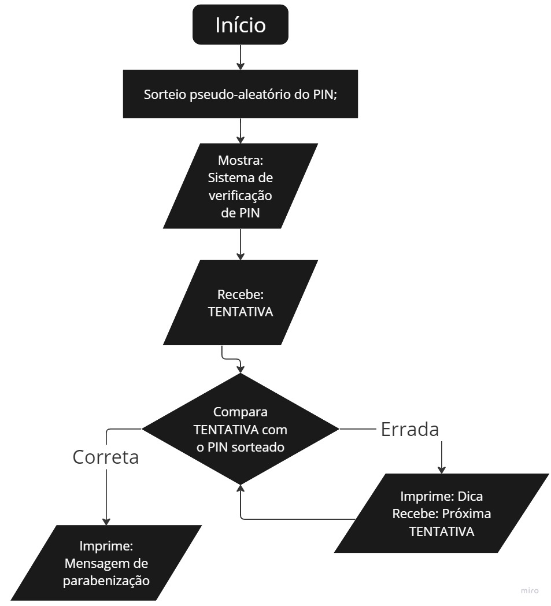

# _Sprint 1: Metodologia ágil, git e JavaScript_
## _Sistema de verificação de PIN_

O projeto consiste em um sistema em que o usuário deve adivinhar um PIN com ajuda do sistema que informará uma das seguintes informações após cada tentativa:

- Errado... Tente um PIN muito MAIOR;
- Quase! Tente um PIN MAIOR;
- Quase! Tente um PIN MENOR;
- Errado... Tente um PIN muito MENOR.

Ao inserir a resposta certa, o sistema retornará a seguinte mensagem:
- Parabéns, você acertou!!!
O PIN era @@@

na qual "@@@" é o PIN correto.

***

## Sumário
- Como usar;
- Como configurar;
- Diagrama simplificado de funcionamento;
- Processo de desenvolvimento;
- Dificuldades encontradas.

***

## Como usar:
Para utilizar o projeto, basta baixar a pasta completa do repositório e abrir o arquivo "index.html" no navegador de sua preferência. Assim que isso for feito, surgirá uma janela no topo da tela com o título do projeto. Ao clicar em _Ok_, outra janela aparecerá e já pode começar a advinhar o pin digitando um chute e precionando _Enter_ no teclado ou _Ok_ na janela. Digite qualquer PIN de acordo com a instrução já que a resposta correta é aleatória de cada execução.

Ao descobrir o PIN atual ou clicar em _Cancelar_ em algum momento do processo, a atividade é encerrada e será necessário recarregar a página para recomeçar.

_Nota: Como a respota correta é aleatória, ao recomeçar o processo o PIN correto será diferente do anterior._

***

## Como configurar:

Entre na pasta do projeto, depois em _src_ e _JS_. Dentro da pasta _JS_ haverá um arquivo chamado "script". Abra o mesmo com o editor de texto da sua preferência. Os parâmetros disponíveis para configuração estão logo nas duas primeiras linhas:

- raioDeProximidade = 0.15;
- numeroDeDigitos = 3;

_Nota: Não é recomendado alterar outras linhas do código para que o mesmo funcione sem problemas._

O parâmetro "raioDeProximidade" define o que é considerado próximo para o sistema. A configuração padrão é "0.15", o que significa que se a tentativa estiver a até 15 % de distância da resposta correta em relação ao intervalo inteiro ela será classificada como próxima.
Exemplo:
Se o sistema está configurado para 3 dígitos, o "raioDeProximidade = 0.15" diz que se a tentativa estiver a até 150 (999 * 0.15) números de distância, ela estará próxima e sistema dirá que a próxima tentativa deve ser maior ou menor. Se a tentavia não estiver nesse raio de 150 números, o sistema orientará o usuário a tentar um PIN muito maior ou muito menor.

O outro parâmetro a ser mudado é o "numeroDeDigitos = 3". Esse é bastante intuitivo, o valor inserido nele indica literalmente quantos dígitos terá o pin que o usuário deve advinhar.

***

## Diagrama simplificado de funcionamento:

## Processo de desenvolvimento:
A versão final e inicial do script mudaram em pouca coisa. Inicialmente o sistema informava o intervalo que o usuário deveria digitar seu pin (0 a 999) e não havia análise prévia do formato do dado inserido pelo usuário, o que deixava implícito que o dado inserido pelo usuário era mais um número inteiro que um pin propriamente dito, além de não lidar com números negativos ou textos no meio do pin.
Esses problemas foram concertados no commit seguinte, sendo necessário ajustar as partes do código que usavam o intervalo (0 a 999) como parâmetro para funcionarem com o número de dítigos. Foi inserido um teste para rejeitar pins que tivessem a quantidade errada de dígitos ou que tivessem caracteres diferentes de números no seu conteúdo.

***

## Dificuldades encontradas
As maiores dificuldades encontradas envolveram o novo teste inserido no segundo comit e os dígitos com 0 a esquerda. Como o prompt recebe string como resposta, pensar em formas de analisar a entrada quanto à quantidade de dígitos e ao significado do que foi digitado exigiu algum tempo. Além disso, foi necessário pesquisar para encontrar uma forma de imprimir 0s caso o pin sorteado fosse um número com 0s a esquerda.

Não está diretamente ligado ao código, mas tive muita dificuldade para conseguir encontrar uma forma de desvincular o git da minha conta pessoal do github e vincular na que tinha acesso ao repositório.
